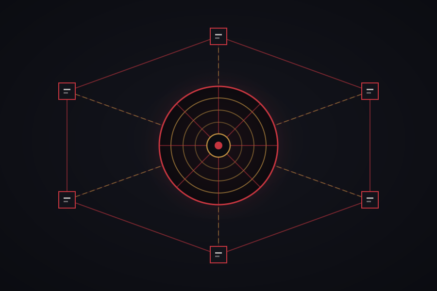

<div align="center">


# makima

**A mesh network you own end to end.**<br>
*Every machine you have on one flat address space — no accounts, no third party, no coordination server but your own.*

</div>

---

makima is a WireGuard mesh with its own control plane. You run the coordination
server, you run the relay, and no packet or key ever touches infrastructure you
do not administer.

It is built the way Tailscale is built, because that architecture is right: a
central service that decides *who may talk to whom*, and direct encrypted paths
that carry the traffic without passing through it. [How it fits
together](#how-it-fits-together) draws it: gold chains from the centre to every
node, crimson paths straight between them.

## Status

**Feature-complete.** `makima up` on one machine makes a mesh; one pasted
invite puts another on it. A node is handed an address and receives the mesh's
membership over a long poll that pushes changes as they happen. Local services
are published on the mesh — automatically, as they start — without being
exposed to the LAN, the host firewall is configured to let tunnel traffic
through, and a web interface shows what is reachable and what is broken.

It reaches its peers directly where it can and through a relay where it
cannot, upgrading to a direct path the moment one is found. Names resolve,
access is governed by policy, subnets and exit nodes route, and a mesh that
turns on the network lock no longer has to trust its own control server about
who belongs.

| | | |
|---|---|---|
| **M0** | TUN + WireGuard, static peers | **done** |
| **M1** | control server, registration, netmap long-poll | **done** |
| **M2** | relay — works from anywhere, no port forwarding | **done** |
| **M3** | disco — STUN, endpoint exchange, hole punching, direct paths | **done** |
| **M4** | port mapping — NAT-PMP and PCP | **done** |
| **M5** | DNS names, ACLs, exit nodes, subnet routes | **done** |
| **M6** | network lock — node-key signing, key rotation | **done** |
| **M7** | one-command setup — `up`, invites, services that publish themselves | **done** |

What this has *not* had is a week of running on real machines behind real NATs.
The protocol packages are well covered — policy, disco, serve and the DNS
server sit near 90%, the relay and the path-selecting socket are tested end to
end — but the command-line layer that wires them together is barely covered at
all, and tests are not the same as a laptop moving between a café and a home
network either way. See [Known limits](#known-limits).

## Install

**There is no published release yet, so today this is built from source.**
Everything below works from a clone; the packaged routes are written and wired
into [the release workflow](.github/workflows/release.yml), and go live with
the first `v*` tag. They are listed further down so it is clear what is coming
and what is not yet there — not as instructions that quietly fail.

```sh
git clone https://github.com/justin06lee/makima && cd makima
make
```

`make` is the whole golden path: build the four binaries, put them in
`/usr/local/bin`, build the app where Rust and bun are present, and start again
exactly what was running. Requires Go 1.26 or newer; the app is skipped with a
note when its toolchain is absent.

```sh
make            # the golden path, above
make build      # produce the binaries in ./build and nothing else
make install    # the same as make
make update     # the same as make — for when you mean "pick up my changes"
make uninstall  # take makima off this machine entirely
make check      # fmt, vet, test, and the race detector
make release    # cross-built archives and checksums, in dist/release
```

Then, on a machine with nothing installed on it at all:

```sh
go run github.com/justin06lee/makima/cmd/makima@latest try -serve 8080
```

<details>
<summary>What an install does and does not touch</summary>

Installing keeps your state. The network this machine is on — or holds — its
keys, its address, the app's settings and the launchd or systemd registrations
all stay exactly as they were. What is replaced is the binaries, and what is
restarted is precisely what was running: a node that was deliberately down
stays down, and the server and relay come back only on the machine that was
running them. [`dist/update.sh`](dist/update.sh) is the whole of it.

One thing is deliberately removed: a `/etc/sudoers.d/makima_*` rule written by
an app old enough to have asked for wildcards (`makima join *` and friends,
with no password). The app writes a narrower one the next time you say yes.

A config written by an older makima is brought forward on the next start —
fields it never wrote are filled in, fields a *newer* makima wrote are left
alone rather than stripped, and a copy of the original is kept beside it as
`node.json.v<N>.bak`. What cannot be guessed is refused rather than invented:
a managed node with no machine key is asked to rejoin, because inventing one
would quietly make it a different machine.

`make uninstall` is the other thing entirely — it runs
[`dist/uninstall.sh`](dist/uninstall.sh), which stops everything, removes every
registration, and deletes the network this machine was on or held, the logs,
the resolver file, the app and its data. The old network's keys are copied to
`/tmp/makima-uninstalled-*` first; `/tmp` is cleared on reboot, so that is a
safety net for the next hour, not a backup.

</details>

<details>
<summary>The packaged routes, once there is a release</summary>

None of these work yet — there is no tag, so there is nothing for them to
fetch. They are here so the shape of the plan is visible.

```sh
# the installer: one archive, checked against the release's SHA256SUMS
curl -fsSL https://raw.githubusercontent.com/justin06lee/makima/master/dist/install.sh | sh

brew install justin06lee/makima/makima     # macOS and Linux
yay -S makima                              # Arch
nix run github:justin06lee/makima          # Nix
docker run -p 3478:3478 ghcr.io/justin06lee/makima   # a relay
```

Two things are worth knowing before any of them is real:

**The app is not signed or notarized.** A `.dmg` downloaded from a release
would be quarantined by Gatekeeper and refuse to open, and this app installs a
sudoers rule — which is exactly the kind of thing signing exists to vouch for.
Until there is a Developer ID certificate in the release workflow, building it
yourself is the only honest way to run it.

**The checksum is not a signature.** `install.sh` refuses to install anything
it cannot check, which catches a corrupt download and a mismatched build. It
does not catch a compromised release: the archive and the sums come from the
same place over the same connection. Signing the checksums is the fix and is
not done.

</details>

Then, without changing anything on the machine and without a password:

```sh
makima try -serve 8080
```

Linux and macOS today. Windows cross-compiles and can reach a mesh, but its
address assignment is not wired up yet, and the built-in SSH server does not
run there.

## Use

Two devices, two steps. On the first one, **Start a network** — in the app, or:

```sh
makima up
```

On every device after that, **Join a network** and type the fifteen words the
first one showed — or paste its invite:

```sh
makima join mk1_...
```

That is the whole setup. The rest of this section is what the two steps do and
what to decide about the first one.

Pick the machine that will hold the mesh together, and run:

```sh
makima up
```

**Pick it deliberately.** It is the one machine every other has to be able to
reach: they check in with it to learn where each other are, and when two of
them cannot connect directly, they meet on the relay it carries on the same
port. A desktop at home is a fine choice. Out of the box it only works inside
the house, and `makima up` says so; two steps make it work from anywhere —
see [Working from anywhere](#working-from-anywhere).

If you already self-host something on a public name, you have already solved
this and can reuse it. Whatever carries `something.example.dev` into your
network — a reverse proxy, a port forward — can carry the coordination plane
too. Point it at the server's port — 8080, or the next free one if something
already has 8080, which `makima up` says — and say so:

```sh
makima up -advertise https://makima.example.dev
```

Or put it on anything with a public address; a small VPS is plenty.

That is the whole thing. There is no mesh yet, so it makes one, puts the
coordination plane on this machine, turns on names, joins itself, starts the
daemon, and prints an invite. It asks for sudo when it needs it rather than
failing with advice about it.

It also stays up. Every process `makima up` starts is registered with launchd
on macOS or systemd on Linux — started at boot, restarted if it dies — so a
device is on the network from the moment it powers on until `makima down`,
which takes the registration away again. Nobody has to know there is a daemon,
because nobody has to start one.

On every machine after, type what it printed into the app, or paste it:

```sh
makima join mk1_...
makima join abandon ability able about above absent absorb abstract absurd abuse access accident account accuse achieve
```

Two forms of the same thing. The string is for a machine you can paste to.
The fifteen words are for one you cannot — the laptop that is not on the
network yet — and the first four letters of each word are enough. Five of the
words say where the network's server is, ten are a secret, and the server
proves its own public key to whoever holds them; so neither form ever asks a
joining machine to trust a key it fetched over the connection it is about to
trust, which is what makes an impostor in the middle detectable rather than
invisible.

```sh
makima invite        # another one, for the next machine
makima status        # what this machine can see, and anything wrong
makima down          # stop, and stay stopped across restarts, until up again
```

Each node is handed an address from `10.77.0.0/16` and learns about the others
automatically. Nodes appearing and disappearing propagate within milliseconds —
the daemon holds a long poll open, so a change is pushed rather than discovered
on a timer.

### Coming from Tailscale

If your devices are already on a tailnet, there is nothing to do by hand. The
app notices Tailscale and offers **Move from Tailscale**; in a terminal it is:

```sh
makima migrate
```

It reaches every device the way you already do — over Tailscale, with SSH,
Tailscale SSH included — and looks before it touches anything: what each one
runs, whether it can become root, which ones cannot come along (phones, anything
offline, devices shared in by somebody else). Then it asks the one real
question: which device should be the **Control Devil**, the one holding the
network. It recommends one — a machine with a public address if you have one,
otherwise a server that stays on — and says why.

Then, for every device you chose:

1. makima goes on it, copied from this device. The app carries builds for the
   other platforms, so a Mac can set up a Linux server with nothing downloaded.
2. Your SSH keys go on it — this device's public keys, from `ssh-agent` and
   `~/.ssh/*.pub`, into `~/.ssh/authorized_keys`, each once — so ordinary
   `ssh` keeps working once Tailscale SSH is gone. Where the move gets in as
   root, they go to the account named after your tailnet login instead
   (`justin06lee` for `justin06lee@github`), if the device has one. Beside
   them goes a key made for this move alone: no passphrase, and good only from
   makima's own addresses. It is what the move logs in over makima with, so a
   key of yours that has a passphrase is never in the way, and it comes off
   every device, and this one, when the move ends. The move then tries a plain
   `ssh` to the device's own LAN or public address and says whether that
   works. A device with nothing listening for ordinary SSH gets makima's own
   SSH server on port 2222, with the same keys. If this device has no SSH key
   at all, the move stops before changing anything and says to run
   `ssh-keygen -t ed25519`.
3. The network starts on the Control Devil, reachable at its LAN or public
   address — never a Tailscale one, since the network has to work once
   Tailscale is gone. If the Control Devil was on a network from an older
   makima, in `100.64.0.0/10`, that network is started over in `10.77.0.0/16`.
4. Each other device proves it can reach the Control Devil *without*
   Tailscale, then joins — beside Tailscale, which keeps running. One that
   cannot is left exactly as it was. The invite goes over the SSH session's
   input, never onto a command line.
5. Your device logs in to each one over makima — `ssh` to its makima address,
   and a command that answers. One that is not reached says why: it never
   showed up on the network; it is on the network but no connection came up,
   most likely a firewall dropping UDP 51820; or makima reaches it but `ssh`
   over makima did not get in.
6. With *Uninstall Tailscale* on, each device that was reached has Tailscale
   removed — over makima, so the session doing it does not depend on what it
   removes — and is checked to still answer. Your device goes last, and only if
   every device that came along was reached; otherwise it keeps Tailscale
   beside makima and says which devices are why.

So Tailscale never comes off a device until makima has been shown to reach it
from where you are, and it is never stopped before that either. A device that
does not make it across has had Tailscale running the whole time, so there is
nothing to roll back. Each device ends *moved* (on makima, Tailscale removed),
*both* (on makima, Tailscale still beside it), or *stayed* (Tailscale as it
was).

Each device keeps its MagicDNS name: `tenet.your-tailnet.ts.net` becomes
`tenet.makima`. Turn off *Uninstall Tailscale* to keep Tailscale running
beside makima everywhere instead.

This works because makima has its own address range. Tailscale, on Linux,
drops every packet from `100.64.0.0/10` that did not arrive on its own
interface; makima's `10.77.0.0/16` is outside it, so the two run side by side
on every machine and nothing has to be switched over.

### Services publish themselves

Anything listening on `127.0.0.1` is put on the mesh once it has stayed up for
a few seconds, and taken off again once it has stayed down for fifteen. Start
Ollama and it is at `desktop.makima:11434` from your laptop ten seconds later.
Start a dev server and it is reachable from the sofa, and it stays reachable
while it restarts on save. There is no command. Listeners on the dynamic range
(49152 and up) are left alone: those are other programs' private helpers, on a
different number every run. `makima allow` publishes one on purpose.

That is a deliberate policy: **your mesh is trusted the way this machine is.**
It is the right default for the machines one person owns, and the wrong one the
moment somebody else's laptop joins — so the daemon says which it is doing at
startup, and `makimad -no-auto-serve` turns it off.

```sh
makima allow 8080:3000   # publish a port on purpose, on a different mesh port
makima deny  11434       # keep a port off the mesh, and keep it off
```

`deny` is recorded rather than merely applied, because the scanner runs again
in five seconds and would otherwise put back whatever you just withdrew.

### Is this direct, or going through a relay?

A mesh that works is not the same as a mesh that works well. Traffic through a
relay and traffic straight to the machine on the next desk look identical from
the outside — same address, same commands, same everything except an order of
magnitude of latency.

```sh
makima ping desktop
#   10.77.0.2       relay   relay.example:3478  84.2ms
#
#   Reachable through relay.example:3478. Relayed, not direct —
#   'makima ping -until-direct desktop' waits for an upgrade.

makima ping -until-direct desktop
#   10.77.0.2       relay   relay.example:3478  84.2ms
#   10.77.0.2       relay   relay.example:3478  83.9ms
#   10.77.0.2       direct  203.0.113.9:41641   11.4ms
#
#   Direct path to desktop after 3.2s.
#   Traffic is going straight there — 11.4ms instead of 84.2ms through the relay.
```

Hole punching is not instant and not guaranteed: it depends on what two routers
are willing to do, and the honest answer for the first few seconds is "not
yet". `-until-direct` waits for it and then says plainly whether it happened.
If it never does, that is a real answer too — and the one `makima doctor`
knows how to act on.

### Sending a file

```sh
makima cp report.pdf desktop:
#   report.pdf → /Users/you/Downloads/makima/report.pdf (2.4 MiB in 310ms)

makima inbox                     # where files from other machines land
makima inbox ~/incoming          # somewhere else
makima inbox -off                # stop accepting them
```

Push-only, like scp's simplest form. Pulling would mean letting a peer read a
path of its choosing on this machine, which is a much larger promise than "you
may put a file in one directory" — and `makima ssh desktop cat notes.txt`
already covers it for anyone who wants it.

Receiving is on by default, on the same reasoning as auto-serve: your mesh is
trusted like this machine is, and a feature you have to discover before it
works is one most people never find. The safety is in what a sender can do
rather than in whether it can do anything at all. A transfer may only create a
file **directly inside the inbox** — base names only, no paths, no traversal —
it never overwrites (a second `notes.txt` becomes `notes (2).txt`), it is
capped at 8 GiB by default, and files arrive readable by their owner and nobody
else. A transfer that stalls is cut off; one that is merely slow is not.

On a mesh with access control, the inbox is an ordinary port and needs an
ordinary rule — `"dst": ["desktop:3479"]`.

### Getting a shell

```sh
makima ssh desktop
makima possess desktop     # the same command
```

Sugar over `ssh desktop.makima`, which has always worked — `sshd` listens on
every address, so a peer is reachable the moment the tunnel is up. What this
removes is having to remember the suffix, and the account: with no `user@` and
no `User` in your ssh config for it, it logs in as you when your keys open that
account, and as root when that is what they open instead — which is where a
move from Tailscale puts them on a server.

The app's **SSH** button runs the same command, in a new window of your
terminal. The first time there is more than one — Ghostty, Alacritty, kitty,
WezTerm or iTerm beside the one the system came with — it asks which, and
Settings changes it later.

### A shell on a machine with no sshd

`makima ssh` hands off to the system client, which works right up until the far
end has no sshd — on a laptop, the normal case. macOS ships Remote Login off,
most desktop Linux installs run no server, and turning one on means opening a
service to every network that machine is ever on.

```sh
makima sshd -on                         # use ~/.ssh/authorized_keys
makima sshd -on -keys github:justin06lee # use the keys on a GitHub account
makima sshd                             # what it is doing, and its fingerprint
makima sshd -off
```

It binds the mesh address and nothing else — not the LAN, not localhost, not
the internet. There is no password authentication and no way to add one. Port
forwarding through it is refused, because makima already forwards ports as a
first-class thing that shows up in status and obeys the mesh's access control.
`makima ssh` finds the port on its own.

A session runs as **whoever ran `makima up`** unless the client asks for
somebody else, and asking is granted only by that account's own
`~/.ssh/authorized_keys` — the same file the system's sshd honours, curated by
the same person. So root over the mesh works exactly where root over ordinary
ssh already works, and nowhere else. The username is never taken at face
value: a daemon that runs as root and trusts the name it is handed is a root
shell for anybody holding any authorized key.

`-keys github:USER` deliberately does not carry over. It says who may use this
machine as its owner; it does not say who may be root on it.

`makima possess NAME` with no account named asks the far end which accounts
your keys open, and shows a list to arrow through when there is more than one:

```
Possess tenet as:
› justin06lee  the account makima runs sessions as
  root         the whole machine
  ↑↓ to move, enter to choose, esc to cancel
```

The cursor starts on the ordinary account and root is last, so enter alone is
never the dangerous one. `makima possess root@tenet` skips the list.

The host key is derived from the machine key rather than stored, so it survives
reinstalling makima without a host-key warning and differs on every machine.
`makima sshd` prints the fingerprint so it can be checked out of band, which is
the only way a host key check means anything.

`-keys github:USER` reads the account's published keys, and re-reads them
hourly. It is worth being plain about what that means: whoever controls that
GitHub account can get a shell here. If a read fails, the keys already in force
stay in force — losing the network must not lock you out of your own machine.

This is off unless you switch it on, unlike everything else makima does by
default. Publishing a port or accepting a file into one directory are bounded;
a shell is not, and nobody should discover months later that they had one.

### Whose machine this is

```sh
makima owner                     # who this machine's makima belongs to
sudo makima owner justin06lee    # say, when it could not be worked out
```

The daemon runs as root, and the socket it opens for itself is root's. Beside
it, it opens a second, read-only one for **one account** — the machine's owner.
That account is what the desktop app reads, what lets `makima ping`, `makima
cp` and `makima inbox` run from a shell without sudo, and whose
`Downloads/makima` files from peers land in. It is also the account an incoming
`makima possess` lands on when the other end names none. (`makima status` and
`makima doctor` ask for root regardless: they read the config file, which holds
this node's private keys.)

Normally nobody has to know this exists: `sudo makima up` says who is behind
it, the macOS app says so through its own prompt, and either way the answer is
written into the config and stays true across reboots.

It is worth knowing about for the one case where none of that is available —
**a machine set up over SSH as root.** There is no sudo behind that root and
nobody at the screen, so there is nothing to say whose machine it is. makima
takes the machine's only account if it has exactly one, which covers most
personal machines; with two accounts it cannot guess, and says so in its log
and in `makima doctor`.

The symptom of getting this wrong is peculiar enough to be worth naming:
makima works perfectly as root and appears to be missing entirely to
everything running as yourself — because the socket those things read was
never opened for anybody. One line fixes it, and takes effect immediately
rather than at the next restart.

### die

`makima up` adds a `die` alias to your shell as a shortcut for `makima down`.
It is a fenced block in your own startup file; delete it if you would rather
not have it.

### Administering a mesh

The one machine holding the coordination plane has `makima-server`, and it is
where the mesh is administered from:

```sh
makima-server nodes                  # every machine on it, and what it runs
makima-server forget -name laptop    # evict one; every node drops it at once
makima-server forget -id 3           # when a name repeats, by the ID nodes shows
makima-server update                 # every machine to the latest release
makima-server acl set -file p.json   # who may reach whom
makima-server lock status            # stop trusting this server about membership
```

### Reaching a home server that will not cooperate

This is the problem makima was built for, and it is worth being precise about,
because it usually looks like one problem and is three.

A desktop running Ollama or ComfyUI is unreachable from your laptop. You check
the network, and the network is fine. What is actually happening is some
combination of:

1. **The service is bound to localhost.** Ollama, ComfyUI, Open WebUI, Jupyter
   and vLLM all default to `127.0.0.1`. No amount of correct networking reaches
   a socket that is only listening on loopback.
2. **The host firewall is dropping it.** Arch with GNOME often means firewalld;
   Ubuntu often means ufw. Neither says anything when it drops a packet, and
   the symptom is a connection timeout — indistinguishable from a routing fault.
3. **The router will not hairpin.** Once you have given up and set up a public
   hostname and a port forward, it works from outside the house and fails from
   inside it, because most consumer routers will not send a packet back in
   through the WAN address it just came out of.

The usual escalation makes all three worse: rebind to `0.0.0.0`, which exposes
the service to every device on the LAN; open a firewall port, which exposes it
further; forward it on the router, which exposes it to the internet.

makima removes the LAN from the question entirely:

```sh
# on the desktop
makima up
```

```sh
# from anywhere else on the mesh
curl http://desktop.makima:11434/api/tags
```

Nothing in between. The daemon sees Ollama listening on loopback and publishes
it; `makima allow 11434 -name ollama` is only needed if you want to choose the
name or the mesh port.

A service on another machine on that desktop's network — a printer, a NAS, a
switch's web page — takes a three-part form instead, and the machine behind it
never learns the mesh exists:

```sh
sudo makima allow 8080:192.168.1.50:80 -name printer
```

The daemon listens on the desktop's **mesh address** and forwards to
`127.0.0.1:11434`. Nothing about Ollama changes — it stays bound to localhost,
where it was right to be. The listener does not exist on your LAN, so nothing
on your LAN can reach it. No port is forwarded and the router is never
involved, which is why hairpinning stops mattering: the packets never go near
it.

What does reach the service is what got through WireGuard's cryptographic
authentication and then the mesh's access policy. That is the "requests that
arrive in the name of makima just work" property, made literal.

The firewall is handled too. On start the daemon detects firewalld, ufw, a bare
nftables ruleset or a bare iptables one, and tells it to trust the tunnel
interface — one narrow rule, removed again on exit. It also opens WireGuard's
UDP port, `51820` by default, because the encrypted packets arrive on the LAN
interface before they ever reach the tunnel, and trusting the tunnel alone
lets none of them in. A machine holding the network has its server's TCP port
opened the same way. Pass `-no-firewall` if you would rather do it yourself,
and see `makima firewall status` either way.

In bare nftables every base chain on a hook sees every packet and a drop in
any of them wins, so a table of makima's own would change nothing. Instead
makima inserts its accept rules at the top of each input chain whose policy is
drop, each with a comment beginning `makima ` — `makima iface makima0`,
`makima udp 51820`, `makima tcp 8080` — and finds them again by handle to take
out only its own. iptables-nft's own chains are left to the iptables handling.
firewalld and ufw remember a port they were told to open; the tagged nftables
and iptables rules last until the ruleset is next reloaded, and makima adds
them again each time it starts. `dist/uninstall.sh` removes the tagged rules.
It leaves the firewalld and ufw port rules, since makima cannot tell its port
from the same one opened for something else.

And when something still is not right:

```sh
makima doctor
```

It checks the things that merely *look* like network faults first, in the order
they usually turn out to be the cause, and prints the exact command to fix each
one.

### Working from anywhere

Two machines on the same network find each other without help. Two behind
different routers need somewhere to meet, and the machine holding the network
is it: every node checks in with it to learn where the others are, and it
carries a relay on its own port, at `/relay`, for pairs that cannot connect
directly. Sessions start relayed when they have to and move to a direct path
the moment one is found. Nothing to configure.

What has to be true is that the holding machine can be reached. On a VPS it
already can. At home, it takes a name and a way in:

```sh
# on the machine holding the network — a free name from https://www.duckdns.org
sudo makima-server ddns set -name tenet
```

It checks the name and token (asked for, never echoed) with DuckDNS, keeps
`tenet.duckdns.org` pointed at your home's public address from then on — home
addresses change, and the name follows — and tells every node about it. A node
that cannot reach the server at the address it joined through, because the
laptop left the house, tries the name instead, and the relay follows it there.
The command ends by printing exactly what to forward on your router: one TCP
port for the server and the relay, one UDP port so the others can connect to
this machine directly.

That one step is the only one no program can take, and it is also the one that
can make it impossible. If your ISP puts you behind carrier-grade NAT — your
router's WAN address is not the one https://ifconfig.co shows, or starts with
`100.64`–`100.127` — there is no public address to forward, and the holding
machine has to live somewhere that has one.

Any other address the server answers at can be handed out the same way:

```sh
makima-server urls add -url https://makima.example.dev
```

The relay holds no WireGuard key and decrypts nothing, so relaying costs
nothing in confidentiality. What it costs is the holding machine's upload
bandwidth, which on a home connection is the slow direction. If many machines
lean on it, put a relay somewhere with more, and it takes over:

```sh
makima-relay serve
makima-server relay add -url <that host>:3478 -key <the relay's key>
```

### Updating every machine at once

```sh
makima update            # every machine to the latest release
makima update v0.3.1     # or to that one
```

Run it on any machine in the network. The order goes to the control plane,
and every machine that is on hears it within seconds. Each one fetches the
release for its own platform from this repository's GitHub releases, checks it
against the `SHA256SUMS` published beside it, runs the new daemon once off to
the side to see that it starts here and is the version it claims, and only
then swaps every copy of all four programs together — `/usr/local/bin`, the
app bundle, root's copy the app keeps — and restarts into it in place. The
command stays to show each machine arrive, then checks from here that the
ones that moved still answer:

```
moving every machine to v0.3.1

  tenet                  v0.3.0                 ✓ v0.3.1
  justin06lee            v0.3.0                 ✓ v0.3.1
  huiyuns-macbook-air-2  v0.3.0                 off — moves when it next comes on
  huiyuns-mac (here)     v0.3.0                 ✓ v0.3.1

3 of 3 machines that are on now run v0.3.1.

from here, after the restart:
  tenet                  direct 192.168.1.253:51820 (3ms)
  justin06lee            direct 192.168.1.40:51820 (5ms)
```

They all restart in the same few seconds, deliberately: a mesh that spends a
day half on one version and half on another is what to avoid. A restart comes
back up on the last netmap it had without waiting for the control plane —
which is restarting too — so the gap is a couple of seconds. Traffic over the
mesh stalls for those seconds; a TCP connection, an ssh session say, is
normally patient enough to carry on afterwards. A machine that was off gets
the order when it next comes on.

What can go wrong is contained to the machine it goes wrong on. A release
that will not run there is caught by the dry run and nothing is replaced. One
that runs but will not stay up — dies on the way up three times — has the
previous version put back automatically, and the machine reports why. A
failed machine is not retried on every netmap; running `makima update` again
is what asks it to try again.

An order names a release and nothing else, and a machine refuses anything
older than what it runs, so the most any machine in the network — or the
control plane — can do with it is move the others forward to something this
repository published. A development build ahead of the release is left alone.
The same caveat as the installer applies: the checksum proves the archive is
the one the release published, not that the release itself is honest.

Releases are cut by pushing a tag — `git tag v0.3.1 && git push origin
v0.3.1` — after which the release workflow publishes the archives in a few
minutes. `makima-server update` does the same as `makima update` from the
machine holding the network, and `makima-server nodes` shows every machine's
version. Machines running a makima from before this existed have to be
updated by hand once (`make install` there); from then on this is the way.

### The desktop app

`makima up` and `makima status` are a fine way to run a network and a poor way
to glance at one. The app is the glance, and for most people the whole
program: a menu bar item and a window in the shape every mesh VPN app has
settled on, because it is the right shape.

**The menu bar.** A switch, this device's address, every other device with a
green or grey dot beside it — click one to copy its address — and the exit
node, as a radio group. The window is one click further.

**The window.** Devices down the left, with a search box. Pick one and the
right-hand pane shows its name and address to copy, the services it publishes
with an Open button beside anything a browser can reach, an SSH button that
opens a shell in your terminal, and a place to drop a file — which lands in
that device's inbox. This device's own pane lists what it publishes, with a
Remove beside each, and where incoming files go.

**The first run** asks one question: is this the first device, or is there a
network already? *Start a network* is `makima up`. *Join a network* takes a
pasted invite. *Add device*, in the title bar of the machine holding the
network, shows fifteen words to type into the next one, and the string to
paste for a machine that can be pasted to.
Either answer asks for your password once; after that the device stays
connected, restarts included, until you disconnect. If Tailscale is running, a
third card offers to move the whole tailnet instead — see
[Coming from Tailscale](#coming-from-tailscale) — and the same offer sits above
the device list, and in Settings, until it is taken or dismissed.

```sh
make app        # build it, put it in /Applications (or install the package), open it
```

macOS and Linux, built with Tauri — about 4 MB of its own, plus the four
binaries it carries and the same four for each other platform (about 55 MB,
for moving other machines off Tailscale — `make kits` builds them), using the
web view already running on the machine rather than shipping another browser. It follows the system's light or dark
appearance. It opens at login once a network has been started or joined from
it — the tunnel is up anyway, and this is the menu bar coming back with it —
and Settings turns that off.

It reads over a **second Unix socket** the daemon opens beside its own:
read-only by construction, and owned by the account this machine belongs to, so
exactly one account can reach it and nothing sent down it can change anything.
Everything the app *changes* runs the CLI behind the platform's own
authentication prompt — Authorization Services on macOS, polkit on Linux — so
switching an exit node crosses the same boundary as typing `sudo`, made
visible instead of implicit. A window rendering HTML was never able to
reconfigure your network.

See `desktop/README.md` for the Linux build dependencies and how to work on the
interface without root.

### The web interface

```sh
sudo makimad -ui 127.0.0.1:8088 -ui-write
makima ui
```

(`makima up` starts the daemon without the UI; pass `-ui` yourself to have one.)

One page: this machine, every peer with the path currently in use and its
latency, everything published from here, and the diagnosis. Services other
nodes publish appear as links you can click — the desktop's Open WebUI is a
link on your laptop, which is the entire point.

Bound to loopback by default. Bind it to the node's mesh address instead to
reach it from another machine, and note the trade: `-ui-write` on a
non-loopback address means anyone who can reach that address controls the node.
Without it the page is read-only, which is usually what you want when you are
just looking at a headless box from your laptop.

### Names

```sh
makima-server dns on
```

Then `ssh laptop.makima` works from any node. Only that suffix is routed to the
mesh resolver; the machine's ordinary DNS is untouched, and it is put back when
the daemon exits.

### Access control

By default every node may reach every other node, which is the right default
for the machines one person owns. When it stops being right:

```json
{
  "groups": { "group:laptops": ["laptop", "phone"] },
  "acls": [
    { "action": "accept", "src": ["group:laptops"], "dst": ["tag:server:22,443"] },
    { "action": "accept", "src": ["*"],             "dst": ["printer:631"] }
  ]
}
```

```sh
makima-server acl set -file policy.json
```

Tags come from the credential a machine joined with — `makima-server authkey
-tags server` — never from anything the machine says about itself, because a
node that could tag itself could grant itself whatever the tag confers.

A destination of `*` includes the internet through any approved exit node.
`autogroup:internet` grants that and nothing else — the right to use an exit
node without the right to reach its own services:

```json
{ "action": "accept", "src": ["group:laptops"], "dst": ["autogroup:internet:*"] }
```

A destination that is an address or a range grants that address or range and
no more: `192.168.7.5:22` on a subnet router reaches that one machine behind
it, not the router and the rest of its subnet.

The policy is enforced twice, in two places, for two reasons. The control plane
applies it when building a netmap, so a node is never even *told* about a peer
it may not reach: a key and an address it never receives are a key and an
address it cannot misuse. The node applies the compiled filter to inbound
packets, because visibility cannot express ports. Enforcement is on ingress —
a compromised sender will not filter itself.

### Reaching things that are not on the mesh

A machine can offer to route a subnet, or to carry general internet traffic:

```sh
makima set -advertise-routes 192.168.1.0/24
makima set -advertise-exit-node true
```

Offering a subnet is not enabling it. A node can claim any prefix it likes,
including one that would hijack the whole internet, so a route is installed
nowhere until somebody approves it:

```sh
makima-server routes ls
makima-server routes approve -name nas -all
```

An exit-node offer is different and is accepted as it arrives: it changes
nothing until a person on another device picks that node by name, so the
decision is theirs, made in the open. In the app it is a switch under *This
device*; `makima-server routes revoke -name gateway -exit` withdraws one, and
it stays withdrawn.

To use an exit node: `makima set -exit-node gateway`, or pick it in the app.

### Not trusting your own control server

Everything above is arranged so that compromising the control plane buys as
little as possible: it never sees a private key, never carries a packet, and
cannot decrypt anything two nodes say to each other. What it *can* do is lie
about membership — hand you a peer you never authorised.

The network lock closes that:

```sh
makima-server lock init      # generates a signing key, kept off the server
makima-server lock sign
makima-server lock enable
```

Node keys are now signed by an authority whose private half lives with you, not
with the server, and every node verifies its peers itself before admitting them
to the data plane. A server that invents a peer has to forge a signature it
holds no key for, and the invention is rejected by the entire mesh.

This is why the node and machine keys were separated in the very first commit
rather than retrofitted: signing the WireGuard key specifically is what makes
the guarantee mean anything, and it only works if that key was never the same
thing as the node's identity to the server.

### Without a control server

Two machines can talk with nothing between them. One side prints an address,
the other pastes it:

```sh
# on the first machine
makima pair
#   makima pair mkp1_eyJuIjoi…

# on the second
makima pair mkp1_eyJuIjoi…
#   Paired with desktop at 10.77.11.4.
```

That is the whole procedure. There is no server, no account, no membership and
nothing to administer — each machine simply writes the other into its own
configuration. From there it is an ordinary makima mesh: the same tunnel, the
same NAT traversal, the same `makima ssh`, `makima status` and published
services.

A **pairing address** carries exactly what the far end needs and nothing else:
two public keys, the mesh address this machine answers on, optionally a
preshared key, optionally a relay to meet at, and wherever it currently thinks
it can be reached. Mesh addresses are derived from the node key rather than
handed out, so both ends compute the same answer from public information and
there is nothing to negotiate. There are 16 bits of it, under `10.77.0.0/16`,
so two of your machines landing on the same address is unlikely but possible —
and it is caught and reported at pairing time rather than left to confuse.

Pairing is a **window, not a service**. `makima pair` listens for ten minutes
by default (`-for 1h`, or `makima pair -stop` to close it early); outside that
window the machine answers a knock with silence, not a refusal. Anyone holding
the address can ask, which is why it is time-boxed — and why `-psk` exists:

```sh
makima genkey -psk                    # run once, use the same value both sides
makima pair -psk <the key>            # on one machine
makima pair -psk <the key> mkp1_…     # on the other
```

With a preshared key, an address that leaks is not enough on its own.

Whether the two ever meet depends on the same thing everything else does. On
one LAN, or with one side directly reachable, they find each other with no
third party at all. Behind two NATs they need somewhere to meet: pass
`-relay HOST:PORT` and the knocker adopts that relay from the address. A relay
forwards frames it cannot decrypt between keys it cannot impersonate, so
meeting at one you do not own costs nothing in confidentiality.

### Without root either

`makima try` is makima with the root prompt removed.

```sh
# on the machine with something to share
makima try -serve 8080
#   This machine is laptop at 10.77.11.4. Nothing on it has been changed.
#
#   Run this on the other machine:
#     makima try mkp1_eyJuIjoi…

# on the other one
makima try -forward 18080:8080 mkp1_eyJuIjoi…
#   Paired with laptop at 10.77.11.4.
#     carrying  http://127.0.0.1:18080 → 10.77.11.4:8080
#
#   Direct path to [2600:…]:41641 (3ms).
```

WireGuard runs against a userspace TCP/IP stack instead of a kernel interface
— same engine, same crypto, same NAT traversal, same relay — and connections
terminate inside the process. **No interface is created, no route is installed,
no firewall rule is written, no resolver is touched, and nothing survives
Ctrl-C.** It does not ask for a password because it has nothing to ask for.

The trade is worth stating rather than discovering: because the host kernel
never learns the network exists, an arbitrary program cannot use it. You cannot
point a browser at a mesh address or run the system `ssh` at one. What you can
do is anything this process will carry — `-serve` offers a local port to the
other machine, `-forward` brings one of theirs onto loopback here — which turns
out to be most of what a first try is for.

When you want the other thing — every program on the machine using mesh
addresses directly, surviving reboots, with names and access control — that is
`makima up`, and it is why that one needs root.

### By hand

A static mesh predates pairing and is still the smallest possible thing:
`makima init` and `makima peer add` maintain the peer list yourself.

```sh
makima init -name laptop -addr 10.77.0.1
makima peer add -name desktop -key <public key> -addr 10.77.0.2 \
                -endpoint 192.168.1.50:51820
makima up
```

Only one side needs an `-endpoint`. Whichever machine speaks first teaches the
other where it lives, and the keepalive holds that path open afterwards. A
static mesh gets an ordinary UDP socket rather than the path-selecting one —
nothing tells it about relays and its peers have no disco keys to probe with,
so there would be nothing for it to select between. A serverless one does get
the path-selecting socket, because pairing *is* a disco exchange.

### Addressing

Addresses come from `10.77.0.0/16` — `10.77.0.1`, `10.77.0.2`, and so on, in
the order machines join. It is makima's own range, and the reason it has one
is Tailscale. Tailscale uses `100.64.0.0/10`, and on Linux it drops every
packet from that range that did not arrive on its own interface; a mesh in the
same range could only run there with Tailscale stopped. In a range of its own,
makima runs beside Tailscale on macOS and Linux alike.

The `/16` was picked away from the parts of `10.0.0.0/8` that are taken by
default: `10.0` and `10.1` by home routers and cloud VPCs, `10.42`–`10.43` by
k3s, `10.96` by Kubernetes services, `10.128` and up by cloud regions, `10.211`
by Parallels.

Only `/32` host routes are ever installed, one per peer. That is mostly an ACL
decision — routing the whole `/16` into the tunnel would blackhole traffic to
mesh addresses this node cannot actually see — but it also means that a LAN
which happens to use part of `10.77.0.0/16` loses only the few addresses peers
actually hold.

Networks started by an older makima keep their `100.64.0.0/10` addresses and
keep working. They cannot share a Linux machine with a running Tailscale, and
`makima doctor` says so when they try; starting the network again with this
makima moves it into `10.77.0.0/16`.

## How it fits together



The whole design in one picture: gold chains from the centre to every node,
crimson paths straight between them. The centre decides who may speak to whom;
it never carries a packet.

**Data plane.** A userspace WireGuard device on a TUN interface. Userspace
rather than the kernel module even on Linux, for one reason: it lets the engine
be handed a custom socket. Everything below depends on that.

**The socket.** WireGuard wants a peer to have one endpoint — an address to
send to. A mesh that survives NAT cannot offer it one, because the way to reach
a peer changes: a relay at first, a LAN address once both ends notice they are
on the same network, a hole-punched public address after that, and back to the
relay when the laptop moves. Rebuilding the WireGuard configuration on each
change would tear down live sessions for what is only a routing decision.

So the endpoint handed to WireGuard is not an address at all. It is the peer's
node key, and `internal/magicsock` decides — per packet, invisibly — which path
that key currently resolves to. WireGuard sees one stable endpoint for the life
of the peer and never learns that anything moved.

**Control plane.** The thing that answers, for one node: who am I, and who may
I talk to? A node holds a request open against the server, and the server holds
it until the mesh actually changes, which turns polling into push without
either side maintaining a connection protocol of its own. Every minute it
answers anyway, so a poll killed by some intermediary shows up as a missed
heartbeat rather than a silent desync.

**Relay.** A dumb forwarder keyed by public key. It learns which node sits on
which connection and copies frames between them, and that is the entire
service. Because it only ever forwards already-encrypted WireGuard packets it
is fully untrusted.

**Discovery.** Each node gathers candidate addresses for itself three ways,
each blind where the others are not: its own interface addresses (right on a
LAN, useless behind NAT), addresses observed by STUN servers and by peers
(right on the internet, absent until something answers), and a port mapping
requested from the router (right when the router cooperates). Peers then probe
every candidate from both ends at once and keep the lowest-latency path that
answers.

The probes are sealed under a third keypair — the disco key — so path discovery
works before any WireGuard session exists and a captured probe reveals nothing
about the data path.

### Three keys, on purpose

Every node holds three separate Curve25519 keypairs:

- the **node** key, which is the WireGuard key and encrypts traffic;
- the **machine** key, which identifies the device to the control server;
- the **disco** key, which authenticates NAT-traversal probes.

The split is a security property, not bookkeeping. The control server only ever
learns public halves, so it cannot read traffic between nodes. The worst it can
do is lie about *membership* — and that is exactly what the network lock takes
away.

Control messages are sealed with NaCl box under the machine key. There is no
separate authentication step: only the holder of the right private key can
produce a payload that opens, so a successful decryption *is* the proof of
identity. The relay handshake and disco probes work the same way, through one
shared primitive in `internal/key`.

### Preshared keys

A pair of nodes can additionally share a **preshared key**: 32 symmetric bytes
mixed into their WireGuard handshake alongside the Curve25519 exchange. It
authenticates nobody — two machines with a matching preshared key and the wrong
node keys still cannot talk. What it buys is a hedge against Curve25519 itself.
An adversary recording your traffic today and breaking X25519 in twenty years
still faces a secret that never crossed the wire.

```sh
makima genkey -psk                       # prints one line; use it twice
makima peer add -name desktop -key ... -addr 10.77.0.2 -psk <the key>
```

Both sides must set the same one. A preshared key configured on one end only
does not weaken the tunnel, it stops it: the handshake fails and nothing says
why.

The control plane never carries them. It has no use for one, and a server that
could set preshared keys could hand two peers different ones and sever them
silently — so whatever a server sends in that field is discarded on arrival,
before anything reads it. Preshared keys reach a node the only way a symmetric
secret can: out of band, in a static config or a pairing address.

### The admin socket

`makima-server` keeps its state in one JSON file, held in memory by whichever
process opened it. That is fine for one process and actively wrong for two — a
CLI that mints a credential by editing the file is invisible to a running
server, which still holds, and will later overwrite with, its own stale copy.

So every administrative subcommand talks to the running server over a Unix
socket beside the state file. Its permissions are the whole access control
story: reaching it already requires being able to write the state file. When no
server is running there is no conflict, and they fall back to the file
directly.

Unix socket paths are capped near 104 bytes by the OS, and exceeding it fails
with a bare `invalid argument`. If the state file lives somewhere deep, pass
`-socket /tmp/makima.sock`.

## Known limits

- **The machine holding the mesh has to be reachable by the others.** That is
  self-hosting rather than a limitation of makima, but it is the thing most
  likely to surprise: a coordination plane behind a home NAT makes a mesh that
  only works from inside that house until a port is forwarded to it (see
  [Working from anywhere](#working-from-anywhere)) — and behind carrier-grade
  NAT, no port forward can make it reachable at all.
- **The built-in relay runs on the holding machine's upload bandwidth.** Fine
  for shells and web pages; slow for large files between two machines that are
  both away from home and cannot connect directly.
- **One relay at a time.** Two nodes can only meet on a relay they are both
  connected to, and a relay does not forward to other relays. Registering
  several gives you failover, not load spreading: the control plane picks one
  and the whole mesh follows. Pairing inherits this: a knocker adopts the relay
  named in the address, so two machines that already have *different* relays
  cannot pair through either of them.
- **No UPnP.** NAT-PMP and PCP are spoken; UPnP IGD would need SSDP discovery
  and SOAP for a shrinking share of routers, and every router that speaks only
  UPnP still works through the relay. A router that speaks none of them — many
  ISP-supplied gateways — needs its port forwards set by hand.
- **Subnet routers and exit nodes are Linux-only.** They need NAT, which on
  macOS means editing the system pf configuration — not something a daemon
  should do behind an operator's back.
- **Mesh DNS on Linux needs systemd-resolved.** Without it there is no
  per-interface resolver, and pointing the system at the mesh resolver would
  capture every lookup on the machine rather than just `*.makima`.
- **IPv4 only inside the tunnel.** The socket is dual-stack and IPv6 endpoints
  work as paths; mesh addresses themselves are v4.
- **Published services are TCP only.** A UDP service — a game server, a DNS
  resolver on a peer — is reachable at the peer's mesh address directly, but
  `makima allow` does not forward it, and it is not published automatically.
- **The firewall is configured automatically on Linux and macOS only** —
  firewalld, ufw, bare nftables and bare iptables, and the macOS application
  firewall, which judges by app: there makima allows makimad to accept
  connections, and cannot override **Block all incoming connections**. The
  rules makima adds to a bare nftables or iptables ruleset last until that
  ruleset is next reloaded; the daemon adds them again each time it starts.
- **Automatic publishing trusts the whole mesh.** Every loopback service on a
  node is reachable by every node permitted to see it — including a Postgres
  with trust auth, a debug port, or an unauthenticated admin panel. Right for
  the machines one person owns; wrong the moment the mesh has somebody else's
  laptop on it, at which point use ACLs or `-no-auto-serve`.
- **`makima try` is only usable by itself.** With no kernel interface, the
  host does not know the network exists, so an arbitrary program cannot use a
  mesh address — only the ports that process is asked to carry. That is the
  price of not needing root, and `makima up` is the other side of the trade.
- **File transfer is push-only.** `makima cp` puts a file in a peer's inbox;
  there is no pull, because letting a peer read a path of its choosing here is
  a far larger promise. `makima ssh desktop cat notes.txt` covers it.
- **The built-in SSH server is Unix-only.** Windows has no pty to allocate and
  no credential to drop to, so it refuses to start there. There is no sftp
  subsystem and no port forwarding through it. Certificates are not understood
  either: an authorized_keys line carrying `cert-authority`, a forced
  `command=`, or an expiry is not honoured here, and the system's own sshd —
  which does implement them — is still free to accept it.
- **Preshared keys never travel over the control plane.** They are symmetric
  secrets shared by two nodes, so they have to arrive out of band — in a
  pairing address, or typed twice into `makima peer add`. A managed mesh cannot
  distribute them, by design.
- **No replay protection on the control channel.** Messages are sealed and
  authenticated, but nonces are not tracked, so a captured registration could
  be replayed to revert a node's key and endpoints to older values.
- **The app remembers your password for Connect and Disconnect only.** Saying
  yes once writes a sudoers rule for the handful of commands that change
  nothing about who this machine trusts. Adding a device, joining a network,
  choosing an exit node and moving off Tailscale ask every time, because a
  standing grant for those would let anything else running as you put this
  machine on a network of its choosing without a prompt. Deleting
  `/etc/sudoers.d/makima_<you>` makes everything ask again.
- **The app is not signed or notarized**, so it has to be built rather than
  downloaded. See [Install](#install).
- **`makima update` moves the four programs, not the app's window.** The daemon
  the app runs, and the copies inside its bundle, are updated with everything
  else; the app's own interface is not, until it is rebuilt with `make`.
- **A machine updating restarts its daemon, and with it anything the daemon
  itself serves:** a session on the built-in SSH server (`makima sshd`, which
  `makima possess` prefers when it is on), a file transfer in flight, and
  connections to its published ports, which it proxies. Anything talking to a
  mesh address directly — `possess` through the system's own sshd, a database
  client — sees a stall of a couple of seconds, not a disconnect, as long as
  it is patient for that long.

## Layout

```
cmd/makima          CLI — join a mesh, or maintain a static one
cmd/makimad         node daemon — brings up the tunnel, follows the netmap
cmd/makima-server   the control plane
cmd/makima-relay    the relay

internal/key        Curve25519 keypairs, and the sealed-box primitive
internal/wg         userspace WireGuard on a TUN device
internal/magicsock  path selection: relay, direct, and the upgrade between
internal/relay      the forwarder, its client, and its wire format
internal/disco      the probe protocol that finds direct paths, and knocks
internal/pair       serverless pairing addresses: two machines, no server
internal/invite     a whole join as one pasteable string, or as fifteen words
internal/stun       asking a public server what address we appear to come from
internal/ddns       keeping a DuckDNS name pointed at the holding machine
internal/update     moving a machine to a release, and back if it will not run
internal/portmap    asking the router to forward a port (NAT-PMP, PCP)
internal/serve      publishing a local port on the mesh, and nowhere else
internal/drop       sending a file to another machine, and receiving one
internal/sshd       a shell server that only ever listens on the mesh
internal/rootless   a whole node in one process: netstack, no root, no traces
internal/localapi   the daemon's local API and the embedded web interface
internal/netmap     the mesh's view of itself; renders to a WireGuard config
internal/control    the coordination protocol, its server, client, and store
internal/policy     who may talk to whom, and the filter nodes enforce
internal/dnsserver  mesh name resolution
internal/netcfg     per-platform addresses, routes, resolvers, and NAT
internal/conf       on-disk node identity

desktop/            the Tauri app: a menu bar item and a window over the local API
desktop/devserver   a pretend mesh, so the UI can be built without root

dist/install.sh     one archive, one checksum, four binaries
dist/packaging      homebrew formula, PKGBUILD, Dockerfile
dist/*.service      hardened service units for servers run by hand; `makima up` registers its own
flake.nix           the Nix build
```

## License

MIT
